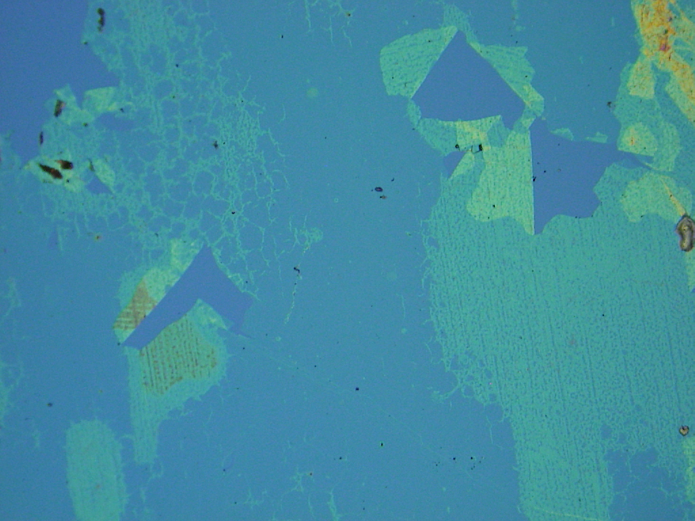

# hbN-Crack-Detection YOLOv8n Model Inference

This repository hosts the Jupyter Notebook used for crack detection in hexagonal Boron Nitride (hBN) coatings as described in the paper "Automated Crack Detection in 2D Hexagonal Boron Nitride Coatings Using Machine Learning". The notebook demonstrates the application of a pre-trained YOLOv8n model to detect cracks in hBN films, as used in the study.

## Paper Reference

Rahman, M.H.-U., Shrestha Gurung, B.D., Jasthi, B.K., Gnimpieba, E.Z., Gadhamshetty, V., "Automated Crack Detection in 2D Hexagonal Boron Nitride Coatings Using Machine Learning", Coatings, 2024, 14, 726. [DOI: 10.3390/coatings14060726](https://doi.org/10.3390/coatings14060726)

## Citation

If you find this model useful in your research, please consider citing:

```bibtex
@article{Rahman2024,
  title = {Automated Crack Detection in 2D Hexagonal Boron Nitride Coatings Using Machine Learning},
  volume = {14},
  ISSN = {2079-6412},
  url = {http://dx.doi.org/10.3390/coatings14060726},
  DOI = {10.3390/coatings14060726},
  number = {6},
  journal = {Coatings},
  publisher = {MDPI AG},
  author = {Rahman,  Md Hasan-Ur and Shrestha Gurung,  Bichar Dip and Jasthi,  Bharat K. and Gnimpieba,  Etienne Z. and Gadhamshetty,  Venkataramana},
  year = {2024},
  month = jun,
  pages = {726}
}
```

## Prerequisites

- Python 3.10.12 or higher
- Jupyter Notebook or Jupyter Lab

## Installation

Install the necessary Python packages using the provided commands in the notebook or directly through your terminal:

```bash
pip install ultralytics==8.2.88
pip install pillow==10.2.0
pip install gdown==5.2.0
```

## Running the Notebook in Google Colab

You can also run this notebook directly in Google Colab:

1. Open Google Colab: [Google Colab](https://colab.research.google.com/)
2. Go to `File` > `Open notebook`.
3. Select the `GitHub` tab and enter the repository URL: `https://github.com/bicbioeng/hbN-crack-detection`.
4. Open the `hbN-Crack-Detection-Inference.ipynb` notebook.
5. (Optional) Select GPU accelerator using Edit > Notebook Settings > T4 GPU
6. Run the cells directly in Colab, ensuring you install any necessary libraries as prompted by the notebook.

## Repository Structure

- **`weights/`**: Contains the YOLO model weights. 
- **`sample_images/`**: Sample images for model testing.(visible after downloading the data using notebook)
- **`results/`**: Output images with detection results. (visible after running the notebook)
- **`hbN-Crack-Detection-Inference.ipynb`**: Jupyter Notebook for running the model.
- **`assets/`**: Contains additional project assets.

## Example Images and Results

Below are some examples of input images and their corresponding outputs after crack detection:

- **Input Image 1**
  

- **Output Image 1**
  

- **Input Image 2**
  

- **Output Image 2**
  

These images demonstrate the effectiveness of the YOLOv8n model in identifying and delineating cracks within hBN coatings.
